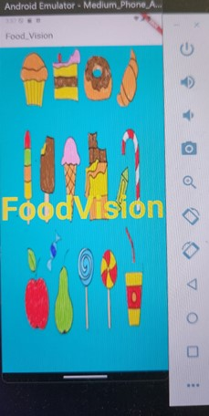
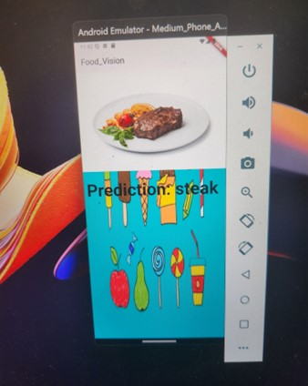

# Food_Vision_Flutter

## Project Images

## 🔍Inspiration

Ever need something to be able to tell what food you're actually gonna eat? Enter Food_Vision, a program which can take any image of a food and predict what food does the image contain

## 🤔What it does?

Food_Vision allows users to upload an image to my flutter software and with the help of computer vision and deep learning, my program would be able to predict the type of food in the image.

## 🔨How I built it?

_For the AI portion:_ I used a pre-trained model called efficientnet_b2. I tried to use other models, like resnet50 and VGG16, as well as a model which I developed which doesn't use transfer learning, but I realised that efficientnet_b2 was the fastest and most accurate model, making it ideal for me.

Its test accuracy achieved values as high as : 92% following results from my other <a href ="https://github.com/Moonshallow5/Food_Vision_mini/blob/main/results.txt">github repo</a>

_For the Mobile App portion:_ I created the mobile app using Google's Flutter framework. Flutter enables you to create native-looking and performing apps for Android, iOS, Windows, and even the web all from one codebase.

Creating the Front-end of Flutter took me about a day, I actually implemented a bottom-navigation bar with access to a camera and gallery (which you don't see it here) but I might just implement it in a future version

Flutter has packages for image selection and specific UI elements, allowing me to develop without recreating the wheel. The classification of the uploaded image is done trough TorchScript

If you want to see a live preview of my project check it out on my <a href="https://huggingface.co/spaces/Moonshallow5/FoodVision_mini?logs=build">HuggingFace</a> account

## 🚧Challenges I ran into

**Training takes a lot of time.**

The model I used in this Flutter project was a pre-trained Efficientnet_b2 with frozen base layers to speed up the training process as I'm running it on CPU to make sure it can be used by everyone.

Utilising transfer learning was pivotal in this project or else training a model without any transfer learning would cost too much time and would likely to overfit 

**Integration was insane.**

Where do I begin? Exporting my PyTorch model to Flutter resulted me puzzled for about 2 days.
Firstly, I had to do some research on how do PyTorch models integrate to Flutter and here begins the series of imports:

1. _Import tflite-1.1.2:_

This import was inbuilt in Flutter's framework, and it has the ability to integrate TensorFlow Lite models into Flutter thus this resulted me to convert my PyTorch model, to ONNX (using a torch.onnx.export function), then to tensorflow (using a onnx_tf function), then to tensorflow lite (using a TFLiteConverter function).

After doing this I realised after a while I had an error saying 

"MissingPluginException(No implementation found for method runModelOnImage on channel tflite)"

and after doing some research on the documentation on pub.dev (which I should have done from the start I know), I realized this plugin hasn't been mantained form the last 3 years. So I did some more research on other plugins within flutter to integrate my PyTorch model.

2. _Import tflite\_flutter-0.11.0:_

This import was meant to be the fix to the previous tflite-1.1.2 import as this import is actively mantained and works the same way, I still needed to turn my PyTorch script into TFLite.

However after I thought everything ran smoothly, I tried to run it on an android emulator and I recieved the error 

"UnmodifiableUint8ListView"

So it was time to look at alternative imports, and then I found:

3. _Import flutter\_pytorch-1.0.1:_

The perfect import came, the only thing I needed to do was to convert my PyTorch model to TorchScript, and even though this was meant to be a simple task it was not until later I realised I needed to specify to run on CPU and not on CUDA (note to my future self).

**Figuring out errors**

When you have as many components in an app as I do - the actual app, the TorchScipt model, and the package - it can be very hard to figure out exactly where a component is broken and what needs to be fixed. The issue could lie with my code, the package, or how I'm integrating the two; maybe the package contains code that breaks with my Flutter version. There are so many factors that depend upon one another, so any errors that come up are incredibly difficult to decipher.

## 💡What I learnt
<ul>
<li>I learnt how to create a mobile application in Flutter and how to effectively test and debug Flutter projects</li>
<li>I learnt how to train a Convolutional Neural Network in PyTorch and convert it to a Torchscript model for mobile</li>

<li>I learnt how to create a fully functioning app with an intuitive UX that is production-ready and achieved our initial goals</li>
</ul>

## 💭What's next for Food_Vision
<ul>
<li>Train the model on Food-101 instead of just pizza,steak and sushi</li>

<li>Fine-tuning the neural network to increase the accuracy values</li>

<li>Add a navigation bar at the bottom of the app</li>

<li>Allow users to track their foods, with the app tabulating their caloric and nutritional intake for the day, and how that compares to the recommended intake for their age, height, and weight</li>
</ul>